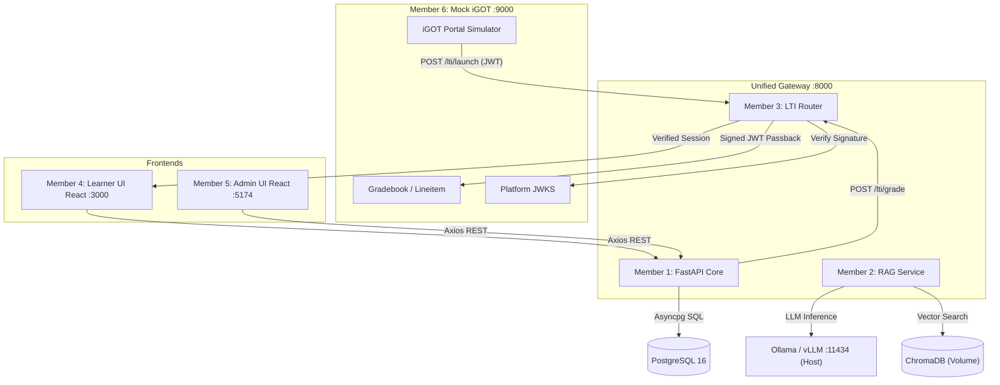

# 06 Architecture — The System Map

This document illustrates the overarching system topology for KarmMitra AI, highlighting how Member 1's backend operates as the central hub.

## Macro Topology (Unified Monorepo)

## Internal Backend Architecture (Member 1)

The backend follows a strict layered architecture:

1. **Gateways (`app/api/`):**
   - HTTP route controllers.
   - Parse incoming JSON payloads into Pydantic models.
   - Return formatted Pydantic responses.
   - *Rule: No raw SQL allowed here.*

2. **Schemas (`app/schemas/`):**
   - Pydantic `BaseModel` classes defining data contracts.
   - Separate models for `In` (Requests) and `Out` (Responses).

3. **Core (`app/core/`):**
   - Engine initialization (`database.py`).
   - Env variable validation (`config.py`).

4. **Models (`app/models/`):**
   - SQLAlchemy ORM models representing PostgreSQL tables.
   - *Rule: Use type-hinted Columns and explicit ForeignKeys.*

## Orchestration Details (Live Unified Stack)
* **Status:** LIVE. The FastAPI Gateway, PostgreSQL Database, and Express Mock iGOT server are successfully running and communicating on the shared `karmmitra_net` Docker network.
* **Root Compose:** `docker-compose.yml` at the repo root orchestrates `db`, `gateway`, and `mock-igot` on `karmmitra_net`.
* **Unified Image:** The `gateway` container installs Python dependencies from all three subsystems (backend, rag-service, lti-security) into a single image.
* **PYTHONPATH:** Set to `/workspace/backend:/workspace`, allowing the gateway to resolve both its own `app` package and cross-team modules.
* **In-Process Integration:** Member 2 (RAG) and Member 3 (LTI) are loaded directly into the FastAPI process via `sys.path` injection in `main.py`, avoiding inter-container HTTP overhead.
* **Volume Persistence:** PostgreSQL data uses `pgdata`, ChromaDB vectors use `chroma_data`.
* **Network Exit:** The container connects to Member 2's Ollama via `host.docker.internal` (mapped via `extra_hosts`).
