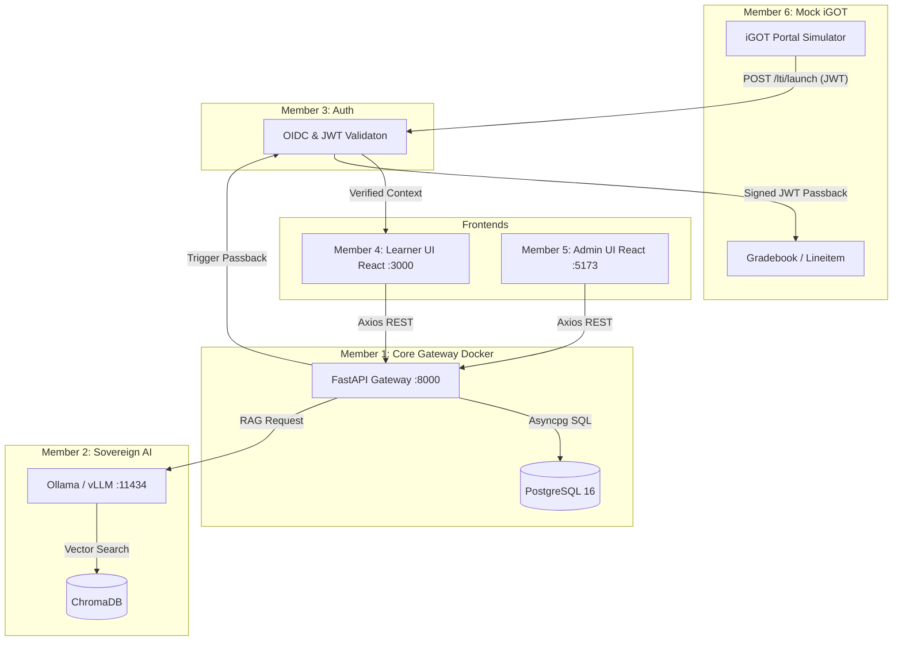

# 06 Architecture — The System Map

This document illustrates the overarching system topology for KarmMitra AI, highlighting how Member 1's backend operates as the central hub.

## Macro Topology

## Internal Backend Architecture (Member 1)

The backend follows a strict layered architecture:

1. **Gateways (`app/api/`):** 
   - HTTP route controllers. 
   - Parse incoming JSON payloads into Pydantic models.
   - Return formatted Pydantic responses.
   - *Rule: No raw SQL allowed here.*

2. **Schemas (`app/schemas/`):**
   - Pydantic `BaseModel` classes defining data contracts.
   - Separate models for `In` (Requests) and `Out` (Responses).

3. **Core (`app/core/`):**
   - Engine initialization (`database.py`).
   - Env variable validation (`config.py`).

4. **Models (`app/models/`):**
   - SQLAlchemy ORM models representing PostgreSQL tables.
   - *Rule: Use type-hinted Columns and explicit ForeignKeys.*

## Orchestration Details
* **Containerization:** The API and DB run on `karmmitra_net` via Docker Compose.
* **Volume Persistence:** PostgreSQL data is mapped to the `pgdata` Docker volume.
* **Network Exit:** The container connects to Member 2's AI engine using `host.docker.internal` to escape the virtual bridge and hit the host machine.
